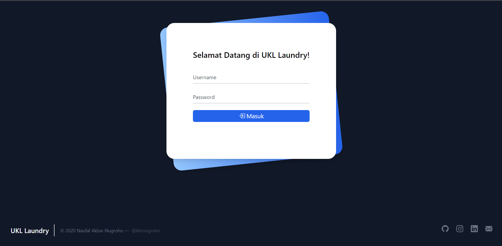

# UKL Laundry PHP Native

Create a UKL Laundry Study Case with PHP Native.

## Resource

Here are the resources that I use in this project:

- [TailwindCSS](https://tailwindcss.com)
- [Bootstrap Icons](https://icons.getbootstrap.com)

## Todo List

**Main**

- [x] Responsive Design
- [x] Conditional Login for Level Role (Admin, Owner, Cashier)
- [x] Update md5 Password

**Admin Side**

- [x] Login 
- [x] Logout
- [x] CRUD Employee 
- [x] CRUD Outlet 
- [x] CRUD Package Type 
- [x] Register Customer 
- [x] Transaction
- [x] Multi Transaction
- [x] Generate Report
- [x] Price Total

**Owner Side**

- [x] Login 
- [x] Logout
- [x] Generate Report
- [x] Price Total

**Cashier Side**

- [x] Login 
- [x] Logout
- [x] Register Customer
- [x] Transaction
- [x] Multi Transaction
- [x] Generate Report
- [x] Price Total

## Screenshoots

- index.php views

- login views

- admin side

- cashier side

- owner side

- generate report

## Authors

Contributors names and contact info

Naufal Akbar Nugroho  
[@kbrnugroho](https://instagram.com/kbrnugroho)
